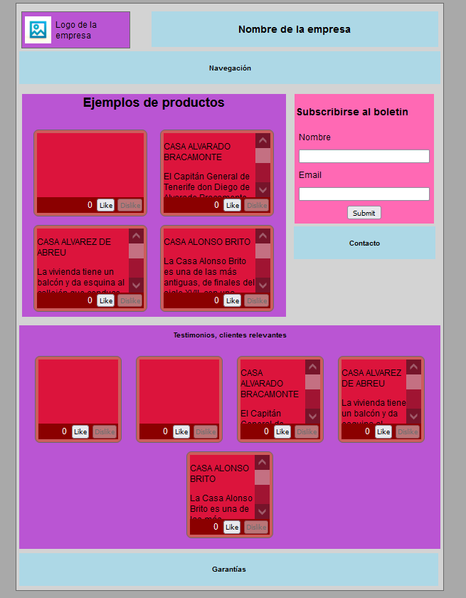

# Project for the subject *Sistemas y Tecnologías Web: Cliente*

Marcos Barrios, alu0101056944

## Description

Using web technologies like `sass` and `webcomponent` for learning purposes.



## Project structure

```bash
.
├── README.md
├── docs
│   ├── about_slots.md
│   ├── webpage.PNG
│   └── webpage_2.PNG
├── package-lock.json
├── package.json
└── public
    ├── assets
    │   ├── bienes.json
    │   └── logo.jpg
    ├── index.html
    ├── src
    │   ├── card-goods-webcomponent.mjs
    │   ├── card-webcomponent.mjs
    │   ├── controller
    │   │   ├── card-controller.mjs
    │   │   ├── card-goods-controller.mjs
    │   │   └── score-controller.mjs
    │   ├── main.mjs
    │   ├── model
    │   │   ├── card-goods-model.mjs
    │   │   ├── card-model.mjs
    │   │   └── score-model.mjs
    │   ├── score-webcomponent.mjs
    │   └── view
    │       ├── card-goods-view.mjs
    │       ├── card-view.mjs
    │       └── score-view.mjs
    └── styles
        ├── README.md
        ├── _base.scss
        ├── _mixins.scss
        ├── _variables.scss
        ├── components
        │   ├── card-goods.css
        │   ├── card-goods.css.map
        │   ├── card-goods.scss
        │   ├── card.css
        │   ├── card.css.map
        │   ├── card.scss
        │   ├── score.css
        │   ├── score.css.map
        │   └── score.scss
        ├── exercises
        │   ├── exercise1.css
        │   ├── exercise1_solution.css
        │   ├── exercise1_solution.css.map
        │   ├── exercise1_solution.scss
        │   ├── exercise2.css
        │   ├── exercise2_solution.css
        │   ├── exercise2_solution.css.map
        │   ├── exercise2_solution.scss
        │   ├── exercise3.css
        │   ├── exercise3.html
        │   ├── exercise3_solution.css
        │   ├── exercise3_solution.css.map
        │   ├── exercise3_solution.scss
        │   ├── exercise4.css
        │   ├── exercise4_solution.css
        │   ├── exercise4_solution.css.map
        │   ├── exercise4_solution.scss
        │   ├── exercise5.css
        │   ├── exercise5_solution.css
        │   ├── exercise5_solution.css.map
        │   ├── exercise5_solution.scss
        │   ├── exercise6.css
        │   ├── exercise6_solution.css
        │   ├── exercise6_solution.css.map
        │   ├── exercise6_solution.scss
        │   ├── experiment.css
        │   ├── experiment.css.map
        │   ├── experiment.scss
        │   ├── modules
        │   │   ├── change_link_colors.css
        │   │   ├── change_link_colors.css.map
        │   │   └── change_link_colors.scss
        │   ├── nested_extend_experiment.css
        │   ├── nested_extend_experiment.css.map
        │   └── nested_extend_experiment.scss
        ├── main.css
        ├── main.css.map
        └── main.scss

```